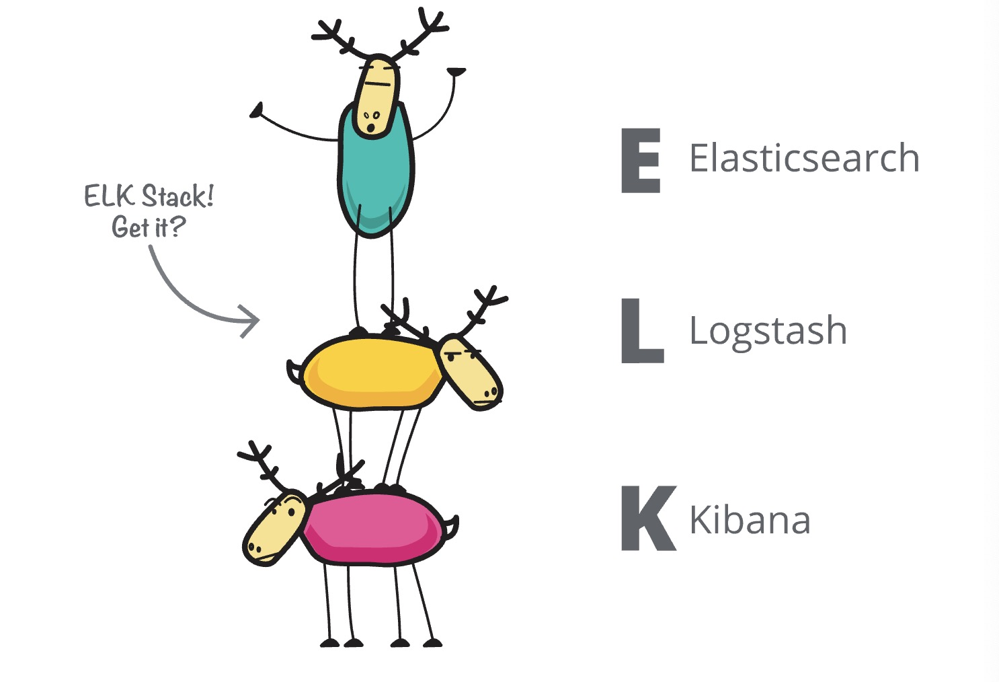

# Elastic Stack Workshop

## 欢迎学习本课程

ELK 是 Elasticsearch、Logstash和Kinina的首字母缩写，ELK Stack是elastic公司三大核心产品的组合方案。

这只小鹿也有它的名字”Elkie“； 下面是关于它的小传。

Elkie：”对我而言，我实际上比人名想象的更多。“

Elkie：”我就是那个你们常说的Elastic Stack。“

Elkie：”我看到了一个ELK Stack。但是更容易使用。更可扩展。更加的强大。“

Elkie：”显而易见的，我的个性术语ELKB型的。“

## 准备事项

* 确保正常稳定的互联网连接
* 可以使用电脑的命令行工具
* 操作系统能够解压缩下载的测试和配置数据文件。

